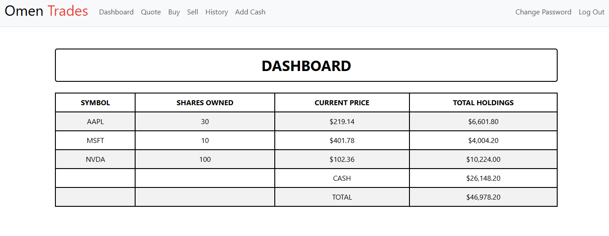
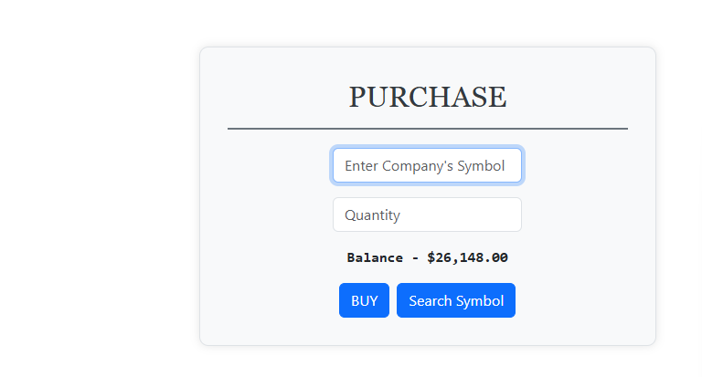

# STOCK TRADING WEBAPP


## 📑 Table of Contents
- [About](#-about)
- [Features](#-features)
- [Tech Stack](#-tech-stack)
- [Installation](#-installation)
- [Usage](#-usage)
- [Screenshots](#-screenshots)


## 📌 About  
This is a stock trading web app made by AMAR (OMEN devs) as a learning project in CS50. (It uses api from cs50 and stock prices are not real, but we are looking to make it more real)
You can add cash (not real just fun), search for stocks and their price, buy, sell and see your dashboard.
Stock functionality is with **stock symbol** and you can search symbol through integrated ai with just stock name.

This was developed as a learning project to explore web development, databases, and APIs.


## ✨ Features
- 🔍 Search for stock symbols
- 💰 Buy and sell shares
- 📊 Track portfolio and holdings
- 🧾 Transaction history
- 🤖 AI for stock symbol searching


## 🛠 Tech Stack
- **Backend:** Python (Flask)
- **Frontend:** HTML, CSS, Jinja2 templates
- **Database:** SQLite
- **LLM** - Gemini Flash
- **Other:** Bootstrap 


## ⚙️ Installation
1. Clone the repository  
   ```bash
   git clone https://github.com/OMENx000/stock-trading.git
   cd stock-trading-app

2. Create virtual environment
    python -m venv venv
    source venv/bin/activate  # On Windows: venv\Scripts\activate

3. Install dependencies
    pip install -r requirements.txt

4. Database setup
    - Install sqlite (if on windows) (https://www.sqlite.org/download.html)
    - Check after installation (sqlite3 --version)
    - Run - **sqlite3 finance.db < schema.sql**

5. Run - flask run

6. Go to http://127.0.0.1:5000


## Usage
1. **Register** yourself in register page
2. **Login** with same credentials
3. **Quote** page is the one in which you can search for stock price by putting stock symbol
4. **Buy** page is for buying stocks.
5 **Sell** your stocks on sell page.
6. You can view all of your **history**.
7. **Dashboard** shows all of your holdings**


## 📷 Screenshots
### Dashboard


### Purchase Page

